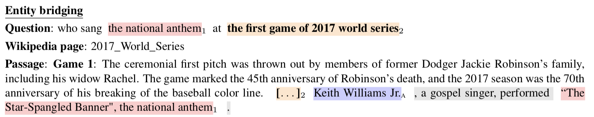

# QED: A Framework and Dataset for Explanations in Question Answering

This page contains the data and evaluation scripts associated with the paper:

**QED: A Framework and Dataset for Explanations in Question Answering** 
by Matthew Lamm, Jennimaria Palomaki, Chris Alberti, Daniel Andor, Eunsol Choi, Livio Baldini Soares, Michael Collins

## Overview of QED

QED is a linguistically principled framework for explanations in question answering. As presented in the paper, given a question and a passage, QED represents an explanation of the answer as a combination of discrete, human-interpretable steps:
1. **sentence selection** := identification of a sentence implying an answer to the question
2. **refential equality** := identification of noun phrases in the question and the answer sentence that refer to the same thing
3. **predicate entailment** := confirmation that the predicate in the sentence entails the predicate in the question once referential equalities are abstracted away.

Here's a simple example: 

Predicate entailment and referential equality are relations which must hold in order for a sentence to answer an question. Consider if in the selected sentence above, the grammatical subject were not "Howl's Moving Castle", but something else. Then referential equality would be broken, and the sentence wouldn't provide a sound answer to the question. Similarly, if the predicate in the sentence did not mention the word "written" but rather mentioned the word "produced," then again answerhood wouldn't hold. 

The annotation definition of QED gives careful treatment to bridging -- a significant but oft-ignored form of reference. In the following example, the question reference "the first game of the 2017 world series" is a bridged argument of the selected sentence. That is, it is not explicitly manifest within the sentence, but nevertheless is a necessary semantic argument for interpreting the meaning of the sentence.

Please see the paper for additional statistics and examples from the data.

## Data Description

The QED dataset consists of a training set of 7638 examples and a validation set of 1353 examples. These are distributed in JSON Lines format, with one QED example per line. Two files are provided:
* nq-qed-train.jsonlines (the training set)
* nq-qed-dev.jsonlines (the validation set)

A QED example consists of an example from the [Natural Questions](https://ai.google.com/research/NaturalQuestions) dataset (NQ) and a QED-style explanation annotation where appropriate. It is a dictionary with the following items:

1. **example_id** := a unique integer identifier that matches up with NQ 
1. **title_text** := the title of the wikipedia page containing the paragraph 
1. **url** := the url of the wikipedia page containing the paragraph 
1. **question_text** := a natural language question string from NQ 
1. **paragraph_text** := a paragraph string from a wikipedia page containing the answer to question 
1. **sentence_starts** := a list of integer character offsets indicating the start of sentences in the paragraph 
1. **original_nq_answers** :=  
1. **annotation** := the QED annotation, a dictionary with the following items and further elaborated upon below:  
    8.1. **referential_equalities** := a list of dictionaries, one for each referential equality link annotated  
    8.2. **answer** := a list of dictionaries, one for each short answer annotated  
    8.3. **selected_sentence** := a dictionary representing the annotated sentence in the passage 
    8.4. **explanation_type** := one of "single_sentence", "multi_sentence", or "none"

### Annotation Format

Each element of a QED annotation, excepting the **explanation_type** (see below), consists of one or more span dictionaries. At a minimum, these contain **start** and **end** (inclusive) character offsets, as well as the **string** associated with the span.

A **selected_sentence** annotation is a span dictionary representing a supporting sentence in the passage which implies an answer to the question.

Each annotation in **referential_equalities** is a pair of spans, the **question_reference** and the **sentence_reference**, corresponding to an entity mention in the question and the selected_sentence respectively. As described in the paper, sentence_references can be "bridged in", in which case they do not correspond with any actual span in the selected_sentence. Hence, sentence_reference spans contain an additional field, **bridge**, which is a prepositional phrase when a reference is bridged, and is False otherwise. Prepositional phrases serve to link bridged references to an anchoring phrase in the selected_sentence. In the case a sentence_reference is bridged, the start and end, as well as the span string, map to such an anchoring phrase in the selected_sentence.

An **answer** annotation is a pair of spans, a **sentence_reference** and a **paragraph_reference**. Most of the time these are identical, except when the answer is bridged-in to the sentence. When this is true, the paragraph_reference corresponds with a span that falls outside of the selected_sentence span, and the sentence_reference contains information on how to bridge the answer into the selected_sentence, as described above for referential equalities.

### Explanation types

Each instance in QED is assigned an **explanation_type** from one of three labels: **single_sentence**, **multi_sentence**, and **none**.
* **single_sentence** instances are cases where there is a short answer in the passage for the provided question, and where there is a valid QED-style explanation for that answer.  
* **multi_sentence** instances are cases where there is a valid short answer in the passage, but where explaining that answer requires reasoning over more than one  sentence in the paragraph. 
* **none** instances are cases where an answer was marked in the passage by NQ annotators, but QED annotators found that there was in fact no actually correct answer in the passage. 

In the latter two cases, the other **annotation** fields are left empty, but the **original_nq_answer** field is populated.

The breakdown of explanation types in the data is as follows:

|                 |  Train  |  Dev   |
|---------------- |---------|--------
| single_sentence |  5,154  |  1,019 |
| multi_sentence  |  1,702  |    183 |
| none            |    786  |    151 |

### Disclaimer

All of the input data for this task comes from Wikipedia, which is licensed for public use by the Creative Commons Attribution-ShareAlike 3.0 Unported License (CC BY-SA) and the GNU Free Documentation License (GFDL).

## Evaluation Scripts

We additionally provide an official evaluation script, `qed_eval.py` to be used for appropriately comparing results on the validation set. The evaluation script expects a predicted file with the same format as input files described above, but with the annotation replaced by predicted values.

Example usage of the evaluation scripts can be seen in `qed_eval_test.py`. In order to run the test, you may need to install `absl` by running
    
    pip install absl-py

## Baseline Results

QED is a general framework for explanations that can be used to define a variety of tasks. In the paper we define four such tasks, and present baseline results for the first two of these.

### Task 1: Recovery of explanations *given* short answer spans

We apply two models to Task 1. The **zero-shot** model is a SpanBERT model pretrained on coreference data, with no training on QED data. The **fine-tuned** model has been additionally fine-tuned on the QED data. We evaluate performance in terms of **mention identification** (a span-level metric) and **mention alignment** (a metric of span pairs).

|Mention Identification|  P  |  R | F1 |
|----------------------|----|-----|----|
| zero-shot | 59.0  |  35.6 | 44.4|
| fine-tuned | 76.8 | 68.8 | 72.6 |

|Mention Alignment |  P  |  R | F1 |
|----------------------|----|-----|--|
| zero-shot | 47.7  |  28.8 | 35.9 |
| fine-tuned | 68.4 | 61.3 | 64.6 |

### Task 2: Jointly predicting answers and explanations

We compare three models on Task 2, according to the metrics above and also in terms of answer accuracy. The **QED-only** model is trained only on QED data, but without answers given as they are in Task 1. The **QA-only** model is trained on all of NQ short answer data. The **QED+QA** model is a multi-task model trained on both QED data and NQ short answer data.

We find that **QED+QA** outperforms the **QED-only** model on the metrics of mention identification and mention alignment:

|Mention Identification|  P  |  R | F1 |
|----------------------|----|-----|----|
| QED-only | 74.1  |  63.8 | 68.6 |
| QA+QED | 77.5 | 64.6 | 70.5 |

|Mention Alignment |  P  |  R | F1 |
|----------------------|----|-----|--|
| QED-only | 63.6  |  54.9 | 58.9 |
| QA+QED | 68.6 | 57.3 | 62.4 |

We also find that the multitask model outperforms the **QA-only** model on answer accuracy, demonstrating that training with comparably few additional QED explanations still leads to an improvement (+1.1%) on answer accuracy.

|      |   Answer Accuracy| 
|----------|----|
| QA-only | 73.4 | 
| QA+QED | 74.5 |

## Contact

Please make use of github issues to ask questions/hold discussion.
